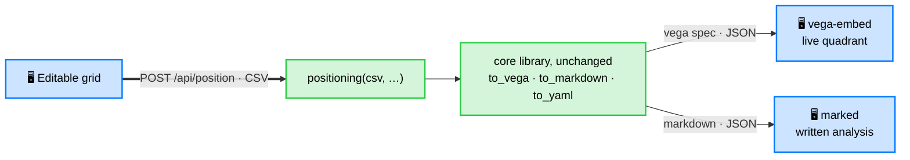

# GUI (browser front-end)

> Status: **shipped**, one of Standpoint's access surfaces. Install the `gui` extra
> (`pip install "standpoint[gui]"`) and run `standpoint-gui`. It takes you from
> editing a table to a quadrant image and written comments, all in the browser, all
> on your machine. The rest of this page explains why it exists and how it is built.


## The opportunity

Standpoint's core is a one-command pipeline, but its audience (marketers, analysts,
PMs, researchers) does not live in a terminal. The CLI is perfect for scripting and
CI; a GUI would open the same engine to people who just want to *type a table and get
a map*. The whole value proposition (derived, labelled, written positioning in one
step) is exactly the kind of thing a small local web app makes approachable.

Crucially, the figure is a **Vega-Lite spec**, so the browser can render it live with
`vega-embed`: no server-side image round-trip for display, full interactivity
(tooltips, pan, PNG/SVG export from the built-in menu) for free. That makes the GUI
unusually cheap to build on top of the existing library.

## What it does

Run it (`standpoint-gui`) and, entirely on `localhost`:

1. **Edit a table**: an editable grid seeded with an example, add/remove options
   (rows) and criteria (columns), rename headers, edit cells, flip a column between
   ⬆️ higher-is-better and ⬇️ lower-is-better, and pick the reference (top-right)
   option. Or **upload a CSV / XLSX** file (Excel is read server-side via pandas +
   openpyxl) and **download** the edited table as CSV or XLSX.
2. **Generate**: the grid is serialized to CSV and POSTed to `/api/position`, which
   runs the real `positioning()` pipeline.
3. **See the quadrant**: the returned Vega-Lite spec is rendered live (SVG, scaled
   to fit its card), with a **Transparent background** toggle and explicit
   **PNG / SVG** export buttons.
4. **Read the analysis**: the Markdown interpretation is rendered below the map and
   **colour-coded**: each highlighted option is tinted by its role (leader red,
   weakest brown, top-pole purple, right-pole blue) to match the dots on the map.
   Downloadable as Markdown.

**Colour discipline**: the ["Good Colors"](https://harchaoui.org/warith/colors/)
palette is reserved for **data only**: the dots on the map and the role-tinted names
in the analysis. The UI chrome (buttons, accents, headings) stays neutral slate/ink,
so a colour in the app always means "data", never decoration. Accessible labels and
keyboard focus rings throughout.

The axis names and the written narrative come from the same local Ollama model the CLI
uses, so a generate call takes a few seconds longer than the geometry alone. The map
itself is computed without the model and is the same every run.

## Architecture

Deliberately thin, so the library stays the single source of truth:

Blue nodes run in the **browser** (one HTML page, no build step); green nodes run in
the **FastAPI** server on top of the unchanged core library.



(Tailwind + vega-embed + marked load from a CDN; the core library never imports the
web layer.)

- `standpoint/api.py`: FastAPI app: `GET /gui`, `GET /api/example`,
  `POST /api/position`, `GET /` → `/gui`. Launcher `main_gui()` (`standpoint-gui`).
- `standpoint/webgui.py`: the whole page as one self-contained HTML string
  (vanilla JS + Tailwind + vega-embed + marked, all via CDN, no framework, no npm).
- `pyproject.toml`: a `gui` extra (`fastapi`, `uvicorn`) and the `standpoint-gui`
  script. The core library and the two CLIs import none of it.

## Run it

```bash
pip install -e ".[gui]"
standpoint-gui                     # → http://localhost:8000/gui
# or: uvicorn standpoint.api:app --reload
```

Local-first: the server binds to `127.0.0.1` only, so the table never leaves the
machine (the LLM, when enabled, is the same local Ollama the CLI uses).

## Limitations

- **Polish.** Column headers truncate at a fixed width; the two-panel layout
  pushes the analysis below the map on narrow screens; no drag-to-reorder yet. All
  are straightforward front-end work.
- **Tests.** `tests/test_gui.py` covers the endpoints (page served, example, the full
  position round-trip contract, both 400 paths, CSV+XLSX upload, XLSX download);
  `tests/test_gui_e2e.py` drives the *real page* in headless Chromium (generate,
  quadrant renders, analysis role-colorized, PNG/SVG buttons, zero JS errors). Both
  skip unless their deps are present (`gui` extra; Playwright + Chromium for the e2e),
  so the default CI suite is unaffected. Run the e2e locally with
  `pip install playwright && playwright install chromium`.
- **Synchronous requests.** With the model on, `/api/position` blocks for ~10–25 s.
  Fine for one user on localhost; a streaming or two-step (spec first, narrative
  after) response would feel better.
- **Scope guard.** The GUI stays an *optional extra* (the `gui` extra); the core
  library and the two CLIs must never import it.

## Roadmap

1. CSV / XLSX upload + download **done**; next: Markdown paste and drag-to-reorder.
2. Two-step response: render the map immediately, stream the narrative when ready.
3. `--reference`, `--top`/`--right` overrides and `--model` surfaced in the UI.

## Design note

The GUI is cheap and natural on top of the existing engine: most of the work is done
by `positioning()` and Vega-Lite, so the browser layer is two files plus one optional
extra. It widens the audience (marketers, analysts, PMs) without touching the core's
dependency path, which is exactly why it ships behind the `gui` extra rather than in
the base install.
