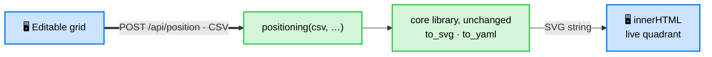
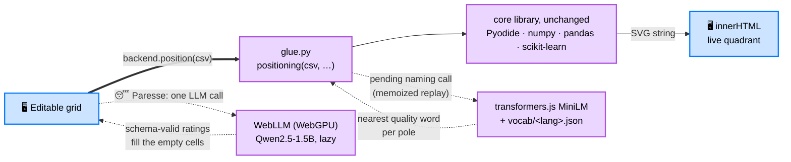

# GUI (browser front-end)

> Status: **shipped**, one of Standpoint's access surfaces. Install the `gui` extra
> (`pip install "standpoint[gui]"`) and run `standpoint-gui`. It takes you from
> editing a table to a quadrant image, all in the browser, all on your machine.
> The rest of this page explains why it exists and how it is built.


## The opportunity

Standpoint's core is a one-command pipeline, but its audience (marketers, analysts,
PMs, researchers) does not live in a terminal. The CLI is perfect for scripting and
CI; a GUI would open the same engine to people who just want to *type a table and get
a map*. The whole value proposition (derived, labelled, written positioning in one
step) is exactly the kind of thing a small local web app makes approachable.

Crucially, the figure is a **self-contained, interactive SVG** straight from the
library (`to_svg`, no Vega, no chart-rendering runtime): the browser drops it
straight into the page with `innerHTML`, no server-side image round-trip for
display, and gets hover tooltips for free (a native `<title>` per dot). Renaming a
pole edits that exact `<text data-pole="…">` node's `textContent` directly: no
spec to rebuild, no re-render. That makes the GUI unusually cheap to build on top
of the existing library.

## What it does

Run it (`standpoint-gui`) and, entirely on `localhost`:

1. **Edit a table**: an editable grid seeded with an example, add/remove options
   (rows) and criteria (columns), rename headers, edit cells, flip a column between
   ⬆️ higher-is-better and ⬇️ lower-is-better, and pick the reference (top-right)
   option. Or **upload a CSV / XLSX** file (Excel is read server-side via pandas +
   openpyxl) and **download** the edited table as CSV or XLSX.
2. **Auto-fill ("Laziness")**: type only the row and column names, then let the local
   model score every empty cell from its own knowledge (`POST /api/autofill`). A
   headers-only upload becomes a full table in one click.
3. **Generate**: the grid is serialized to CSV and POSTed to `/api/position`, which
   runs the real `positioning()` pipeline.
4. **See the quadrant**: the returned SVG is dropped straight into the page (scaled
   to fit its card), with a **Transparent background** toggle and explicit
   **PNG / SVG** export buttons (PNG rasterises the live SVG client-side through an
   offscreen canvas, no server round trip). Exports are named after the table's
   subject (e.g. `programming-languages.png`).

Two header toggles round it off: **🇫🇷 / 🇬🇧 language** (the flag shows the language you would switch to; re-localizes the whole page,
including the model output: pole names and title) and
**🌞 / 🌛 theme** (light / dark, remembered across visits). GUI strings and LLM prompts
live together in `standpoint/locales/i18n.yaml`.

**Colour discipline**: the ["Good Colors"](https://harchaoui.org/warith/colors/)
palette is reserved for **data only**: the dots on the map, rendered server-side by
`gradient_colors()`. The UI chrome (buttons, accents, headings) stays neutral
slate/ink, so a colour in the app always means "data", never decoration. Accessible
labels and keyboard focus rings throughout.

The axis names come from the same local Ollama model the CLI uses, so a generate
call takes a few seconds longer than the geometry alone. The map itself is computed
without the model and is the same every run.

## Architecture

Deliberately thin, so the library stays the single source of truth:

Blue nodes run in the **browser** (one HTML page, no build step); green nodes run in
the **FastAPI** server on top of the unchanged core library.



(Tailwind loads from a CDN; no chart-rendering runtime at all; the core
library never imports the web layer.)

- `standpoint/api.py`: FastAPI app. Pages: `GET /gui`, `GET /` → `/gui`. Data:
  `GET /api/example`, `GET /api/i18n`, `POST /api/upload`, `POST /api/download/xlsx`,
  `POST /api/autofill`, `POST /api/position`. Static: `/favicon.ico`,
  `/site.webmanifest`, `/static/*`. Launcher `main_gui()` (`standpoint-gui`).
- `standpoint/webgui.py`: the whole page as one self-contained HTML string
  (vanilla JS + Tailwind, all via CDN, no chart-rendering runtime, no
  framework, no npm).
- `standpoint/locales/i18n.yaml`: localized LLM prompts **and** GUI strings (`gui:`
  block) for `en` / `fr` / `es`, the single source of truth for language.
- `standpoint/static/`: the app icon set + PWA manifest, generated from
  `assets/logo.png` and shipped as package data.
- `pyproject.toml`: a `gui` extra (`fastapi`, `uvicorn`) and the `standpoint-gui`
  script. The core library and the two CLIs import none of it.

## Run it

```bash
pip install -e ".[gui]"
standpoint-gui                     # → http://localhost:8000/gui
# or: uvicorn standpoint.api:app --reload
```

Local-first: the server binds to `127.0.0.1` only, so the table never leaves the
machine (the LLM, when enabled, is the same local Ollama the CLI uses).

## Static build: the same GUI with no server (`webapp/`)

The page routes its six data operations through one injectable `backend` object
(see the "backend" block at the top of `webgui.py`'s script). The default
implementation is the FastAPI transport above; `webapp/build.py` composes a
**fully static bundle** that injects a Pyodide implementation instead, so the
*same page* runs the *same engine* entirely in the visitor's browser. Upload
the folder to any static host (plain SFTP is enough, e.g.
`https://deraison.ai/standpoint`): nothing to run or maintain server-side, and
the local-first promise gets even stronger, since there is no server at all.

Blue nodes run in the **browser page**; purple nodes are the **in-browser
engines** (WebAssembly) that replace the green server nodes of the diagram
above. The AI strategy keeps every model lazy and local: the always-on path
(axis naming) uses the same small embedding model + curated static data as
[harchaoui.org's in-page RAG](https://harchaoui.org/warith/livre-elephant/rag.html),
and the heavier generative model loads only when its one feature ("Laziness"
auto-fill) is explicitly clicked.



- **Same engine, byte for byte.** The bundle vendors the `standpoint` wheel
  (plus `langdetect` / `openpyxl`); Pyodide supplies numpy, pandas and
  scikit-learn as WebAssembly wheels. `webapp/glue.py` mirrors the endpoint
  logic of `api.py`, same behaviours and error messages.
- **LLM calls become a memoized replay.** `webapp/beh_shim.py` stands in for
  `best-engine-ai-helper`: a model call either hits a seeded answer cache or
  reports the one prompt it is blocked on; the JS driver answers it and re-runs.
  Whatever answers fail, schema-shaped neutral defaults push the engine onto
  its built-in fallbacks (loading-derived pole words, naive plural), so
  **Generate always completes**.
- **Axis naming is on by default, via embeddings, not generation.** The first
  Generate lazily loads the multilingual MiniLM used by harchaoui.org's
  semantic search (transformers.js, a few dozen MB, then browser-cached),
  embeds each pole's criteria as one phrase, and picks the nearest word from a
  curated vocabulary of positive qualities (`webapp/vocab/<lang>.json`;
  confusable entries carry a disambiguating gloss that is what actually gets
  embedded). The engine's `finalize_poles` still validates and dedupes.
- **"Laziness" auto-fill is one direct in-browser LLM call.** The click loads
  a small instruct model once (WebLLM over WebGPU, `Qwen2.5-1.5B`, ~1 GB,
  then browser-cached), sends the engine's own localized `ratings_prompt`
  with schema-constrained JSON output, and fills ONLY the still-empty cells —
  no panel, no copy-paste, no key, nothing leaves the machine. A full table
  gets a clear "nothing to fill" message; a browser without WebGPU gets told
  so. This heavier model never loads unless Paresse is clicked; axis naming
  stays on the lightweight embedding model.

```bash
python webapp/build.py            # writes webapp/dist/ (~4 MB + CDN runtime)
# then upload the CONTENTS of webapp/dist/ to the web folder, e.g. via SFTP:
#   sftp> put -r webapp/dist/* /path/to/htdocs/standpoint/
```

Static-build limitations: the first visit downloads the Pyodide runtime and
wheels from the jsDelivr CDN (~15–20 MB, then browser-cached) and the first
Generate adds the MiniLM download (a few dozen MB, a few seconds); offline or
CDN-blocked, axes fall back to loading-derived words. A forced cross-language
run (FR toggle on an English table) keeps the noun untranslated in the title —
translating it is the one thing only the server's local LLM does. Verified
headless (Playwright + Chromium, with an embedding seam for determinism plus a
real-model spot check): boot, generate, FR/EN + theme toggles, XLSX
round-trip, embedding-named poles, the delegation panel end to end.

## Limitations

- **Polish.** Column headers truncate at a fixed width; no drag-to-reorder yet. Both
  are straightforward front-end work.
- **Tests.** `tests/test_gui.py` covers the endpoints (page served, example, the full
  position round-trip contract, both 400 paths, CSV+XLSX upload, XLSX download);
  `tests/test_gui_e2e.py` drives the *real page* in headless Chromium (generate,
  quadrant renders, PNG/SVG buttons, zero JS errors). Both skip unless their deps are
  present (`gui` extra; Playwright + Chromium for the e2e), so the default CI suite is
  unaffected. Run the e2e locally with `pip install playwright && playwright install chromium`.
- **Synchronous requests.** With the model on, `/api/position` blocks for ~10–25 s.
  Fine for one user on localhost; a streaming or two-step (geometry first, pole names
  after) response would feel better.
- **Scope guard.** The GUI stays an *optional extra* (the `gui` extra); the core
  library and the two CLIs must never import it.

## Roadmap

1. CSV / XLSX upload + download **done**; next: Markdown paste and drag-to-reorder.
2. Two-step response: render the map geometry immediately, stream the axis names
   when ready.
3. `--reference`, `--top`/`--right` overrides and `--model` surfaced in the UI.

## Design note

The GUI is cheap and natural on top of the existing engine: most of the work is done
by `positioning()` and `to_svg`, so the browser layer is two files plus one optional
extra, no chart-rendering runtime to load or version. It widens the audience
(marketers, analysts, PMs) without touching the core's dependency path, which is
exactly why it ships behind the `gui` extra rather than in the base install.
